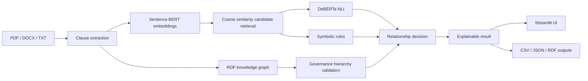

# University Governance Document Consistency Checker

> Explainable hybrid AI for detecting contradictions, entailments, exceptions, redundancies, and hierarchy violations across university governance documents.

## Recruiter quick scan

| Area | Implementation |
|---|---|
| Knowledge representation | RDFLib knowledge graph with governance tiers, clauses, requirements, constraints, and exception links |
| Semantic retrieval | Sentence-BERT `all-MiniLM-L6-v2` + cosine similarity |
| Neural reasoning | DeBERTa NLI for entailment / contradiction / neutral |
| Symbolic reasoning | Numeric conflicts, negation, predicate conflicts, explicit exceptions, redundancy |
| Governance logic | Lower-level clauses are checked against higher-level rules |
| Explainability | Human-readable explanation for every classified relationship |
| UI | Streamlit dashboard, pair comparison, document import, and evaluation metrics |
| Outputs | CSV, JSON, Markdown, and Turtle RDF reports |

## Problem

University governance documents are updated by different offices over time. This can create conflicting attendance rules, duplicated policies, undocumented exceptions, or lower-level procedures that violate higher-level regulations.

Keyword matching alone cannot reliably detect these relationships because semantically similar clauses may use different wording. This project combines **knowledge representation, sentence embeddings, Natural Language Inference, and symbolic rules** in one explainable pipeline.

## Architecture



## Relationship classes

The system detects:

- **Contradiction**
- **Entailment**
- **Neutral**
- **Exception**
- **Redundancy**

It also flags **hierarchy violations** when a lower-level governance clause conflicts with a higher-level rule.

## Evaluation

The manually annotated ground-truth evaluation produced:

| Metric | Result |
|---|---:|
| Accuracy | **94.96%** |
| Precision | **98.91%** |
| Recall | **77.50%** |
| F1 score | **82.82%** |

The high precision means predicted relationships are usually reliable, while the lower recall identifies a concrete improvement target for implicit contradictions and exceptions.

## Dataset

`governance_clauses.csv` is the project source of truth. Each row includes:

- clause ID
- natural-language clause
- clause type
- source document
- governance level
- subject domain
- predicate logic
- exception target and rationale

The repository also contains the manually annotated `ground_truth.csv` used for evaluation.

## Run locally

Install core dependencies:

```bash
python -m pip install -r requirements.txt
```

Build the RDF graph:

```bash
python build_knowledge_graph.py
```

Run structural checks:

```bash
python consistency_checker.py
```

Run offline symbolic/lexical analysis:

```bash
python analyze_governance.py
```

Install neural dependencies and run Sentence-BERT + NLI:

```bash
python -m pip install -r requirements-neural.txt
python analyze_governance.py --neural --threshold 0.50
```

Launch the Streamlit interface:

```bash
streamlit run app.py
```

Run tests:

```bash
python -m unittest -v test_governance_pipeline.py
```

## Main files

```text
governance-consistency-checker/
├── app.py
├── semantic_analyzer.py
├── build_knowledge_graph.py
├── consistency_checker.py
├── document_importer.py
├── analyze_governance.py
├── evaluation.py
├── test_governance_pipeline.py
├── governance_clauses.csv
├── ground_truth.csv
├── relationship_report.csv
├── relationship_report.json
├── analyzed_knowledge_graph.ttl
├── cust_knowledge_graph.ttl
└── docs/
    └── PROJECT_REPORT.md
```

## Outputs

The pipeline can generate:

- `cust_knowledge_graph.ttl` — base RDF knowledge graph
- `analyzed_knowledge_graph.ttl` — graph enriched with inferred relationships
- `relationship_report.csv` / `.json` — pairwise semantic analysis
- `consistency_report.md` / `.json` — structural validation findings

## Limitations

- Neural models require model weights and additional compute.
- Scanned PDFs need OCR before text extraction.
- Implicit exceptions are harder than explicitly linked exceptions.
- Results are decision support, not authoritative legal interpretation.

## Future work

- domain-adapted NLI
- graph neural networks
- OCR for scanned governance documents
- interactive graph visualization
- regulation version tracking
- multilingual policy analysis
- incremental knowledge-graph updates
